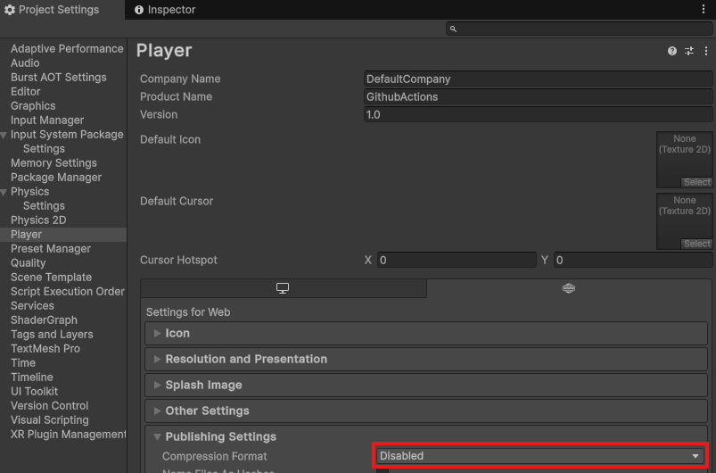
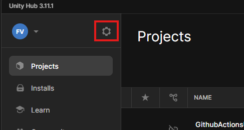
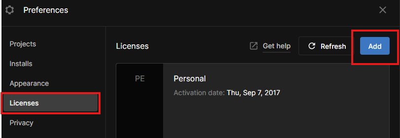

# Unity_GitHubActionsAndPages: Project showing the Unity + GitHub Actions build and deploy to GitHub Pages


A sample Unity project demonstrating how to **build** and **deploy** a WebGL build using **GitHub Actions** and host it via **GitHub Pages**.  
This project uses [game.ci](https://game.ci/) for Unity CI integration.

---

## 🧭 Table of Contents

- [Overview](#overview)
- [Live Demo](#live-demo)
- [Features](#features)
- [Setup Instructions](#setup-instructions)
- [License](#license)

---

## 📌 Overview
This project is created as an experiment to show the build and publish capabilities of GitHub actions for a Unity project.
The workflow heavily relies on the use of [game.ci](https://game.ci/) and [GitHub Actions](https://github.com/features/actions).
The final project will be published on [GitHub Pages](https://pages.github.com)

Each time a new PullRequest is merged into master the `build-and-deploy-WebGL` workflow will trigger, building and publishing the Unity project for WebGL.
The build artifact is then pushed to the `WebGLBuild` branch. Which in turn is used as a source for GitHub pages.
---

## 🚀 Live Demo

Play the project [here](https://florisdev.me/Unity_GitHubActionsAndPages/).

--- 

## 🎮 Features

- 🔄 **CI/CD** – Fully automated build and deploy workflow with GitHub Actions.
- 🌐 **WebGL Output** – Hosted on GitHub Pages for easy sharing.
- 🧱 **Unity Sandbox** – Move 0-friction blocks around with `WASD` in a minimal Unity scene.

---

## 🛠 Setup Instructions
If you would like to apply this simple workflow to your Unity project, follow these steps:


### 1. Disable Compression Format in Unity

GitHub Pages does not support Brotli or gzip compression natively.

1. Open your Unity project
2. Go to `Edit > Project Settings > Player > Publishing Settings`
3. Set **Compression Format** to `Disabled`



---

### 2. Create the Build Branch

This branch will host your compiled WebGL build.

```bash
git checkout -b WebGLBuild
git push origin WebGLBuild
```

---

## 3. Configure GitHub Pages

1. Go to your repository on GitHub
2. Navigate to `Settings > Pages`
3. Under Branch, choose `WebGLBuild`, and set the folder to `/ (root)`
4. Save your changes

---

## 4. Add the GitHub Actions Workflow

1. Go to: [./.github/workflows/](./.github/workflows)
2. Copy the contents of `build-and-deploy-WebGL.yml`
3. In your GitHub project:
   1. Open the `Actions` tab
   2. Press `New workflow`
   3. Choose `Skip this and set up a workflow yourself `
   4. Paste the contents of the `build-and-deploy-WebGL.yml`
4. Update the file
      1. `Line 44`: Point to your Unity project folder
      2. `Line 61 & 85`: Change `WebGLBuild` with your build branch name
5. Rename the workflow and press `Commit changes...`

---

## 5. Set Up Your Personal Access Token (PAT)

1. Create a new token: [Personal Access Tokens](https://docs.github.com/en/authentication/keeping-your-account-and-data-secure/managing-your-personal-access-tokens#creating-a-fine-grained-personal-access-token)
2. Select `Only select repositories`, then select your project repository
3. Add minimally required `Repository permissions` to Access Token:
   1. `Contents` => Read and write
   2. `Metadata` => Read-only
4. Copy and save your token securely
5. Add it to your repo
   1. GoTo `Settings > Secrets and variables > Actions`
   2. Create a *New repository secret*
      1. Name: `ACTIONS_PAT`
      2. Value: *Token value*

---

## 6. Add Unity License and Credentials

You’ll need your Unity license for CI builds:

1. Open **Unity Hub**
2. Go to `Preferences > Licenses`
3. Click `Add` → Choose license type (e.g., Personal)





4. Locate your license file:
   1. Windows: `C:\ProgramData\Unity\Unity_lic.ulf`
   2. Mac: `/Library/Application Support/Unity/Unity_lic.ulf`
   3. Linux: `~/.local/share/unity3d/Unity/Unity_lic.ulf`

5. Add the following secrets to your GitHub repo:
   - `UNITY_EMAIL`: *your Unity account email*
   - `UNITY_PASSWORD`: *your Unity password*
     > NOTE: If you use SSO sign-in *(e.g. Apple, Google, Facebook or other)*, go to [Unity Cloud](https://cloud.unity.com/account/account-settings) → Security and create a specific password.
   - `UNITY_LICENSE`: contents of the `.ulf` license file

---

### 7. Try It Out 🎉

Push to the `main` branch to trigger the workflow.

Or, add this to your workflow YAML to enable manual triggering:

```yaml
on:
  push:
    branches: [ main ]
  workflow_dispatch:
```

---

## 📄 License
[MIT](LICENSE.md) © [Floris de Vries](https://florisdev.me)

## 📚 Resources

Here are some helpful links and references related to this project:

- 🎮 **Unity**
  - [Unity Manual – WebGL Deployment](https://docs.unity3d.com/Manual/webgl-building.html)
  - [Unity Licensing FAQ](https://unity.com/legal/licenses)

- 🤖 **CI/CD & Automation**
  - [game.ci Documentation](https://game.ci/docs/)
  - [GitHub Actions Documentation](https://docs.github.com/en/actions)
  - [GitHub Pages Documentation](https://pages.github.com/)

- 🔐 **Authentication & Security**
  - [Creating a Personal Access Token (GitHub)](https://docs.github.com/en/authentication/keeping-your-account-and-data-secure/managing-your-personal-access-tokens)
  - [Unity Cloud Account Settings](https://cloud.unity.com/account/account-settings)

- 💡 **Related Projects & Examples**
  - [game-ci/unity-actions (GitHub)](https://github.com/game-ci/unity-actions)

- 🛡️ **Badges**
  - [shields.io](https://shields.io)
